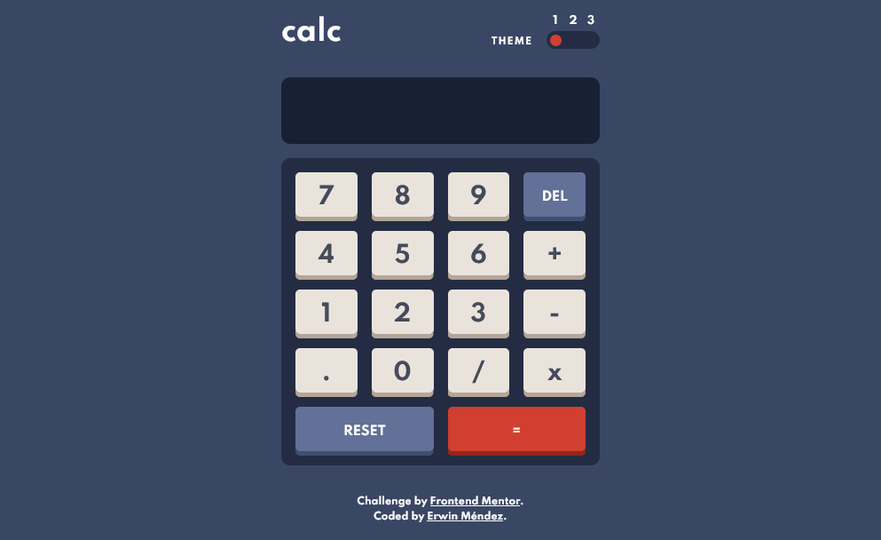

# Frontend Mentor - Calculator app solution

This is a solution to the [Calculator app challenge on Frontend Mentor](https://www.frontendmentor.io/challenges/calculator-app-9lteq5N29). Frontend Mentor challenges help you improve your coding skills by building realistic projects.

## Table of contents

- [Overview](#overview)
  - [The challenge](#the-challenge)
  - [Screenshot](#screenshot)
  - [Links](#links)
- [My process](#my-process)
  - [Built with](#built-with)
  - [What I did](#what-i-did)
  - [Continued development](#continued-development)
- [Author](#author)

## Overview

### The challenge

Users should be able to:

- See the size of the elements adjust based on their device's screen size
- Perform mathmatical operations like addition, subtraction, multiplication, and division
- Adjust the color theme based on their preference
- **Bonus**: Have their initial theme preference checked using `prefers-color-scheme` and have any additional changes saved in the browser

### Screenshot

### Links

- Solution URL: [FrontEnd Mentor](https://www.frontendmentor.io/solutions/calculator-app-with-theme-toggle-VMgnLGrt3)
- Live Site URL: [Firebase](https://calculator-app-91344.web.app)

## My process

### Built with

- [React](https://reactjs.org/) - JS library
- Styled Components
- React Hooks
- Context API
- LocalStorage

### What I did

I decided to use styled components for this project. Most of the styled components are found in the sub-folder `components/styled`, thus separating as much as I could every functional component into structural pieces. I also decided to manage both the theme and the input calculation using react hooks and the context API, having the actual logic of the calculator in the `InputContext` and the theme toggle logic in the `ThemeContext`.

I also took the liberty to add some extra validation to allow for keyboard input. It's the opposite of "keeping it simple", but I just wanted to make it a little more functional and as close to an actual calculator as it could be.

### Continued development

I would like to take some more time to structure the project in a more organized way for a future challenge. For instance, separate some of the logic in the Contex by using helper functions (which was the initial reason for having that extra file), so to make it easier to add further changes and more complex validations to the code.

## Author

- Website - [Erwin Méndez](https://github.com/erwinrmendez)
- Frontend Mentor - [@erwinrmendez](https://www.frontendmentor.io/profile/erwinrmendez)
- Twitter - [@ErwinRMendez](https://twitter.com/ErwinRMendez)
